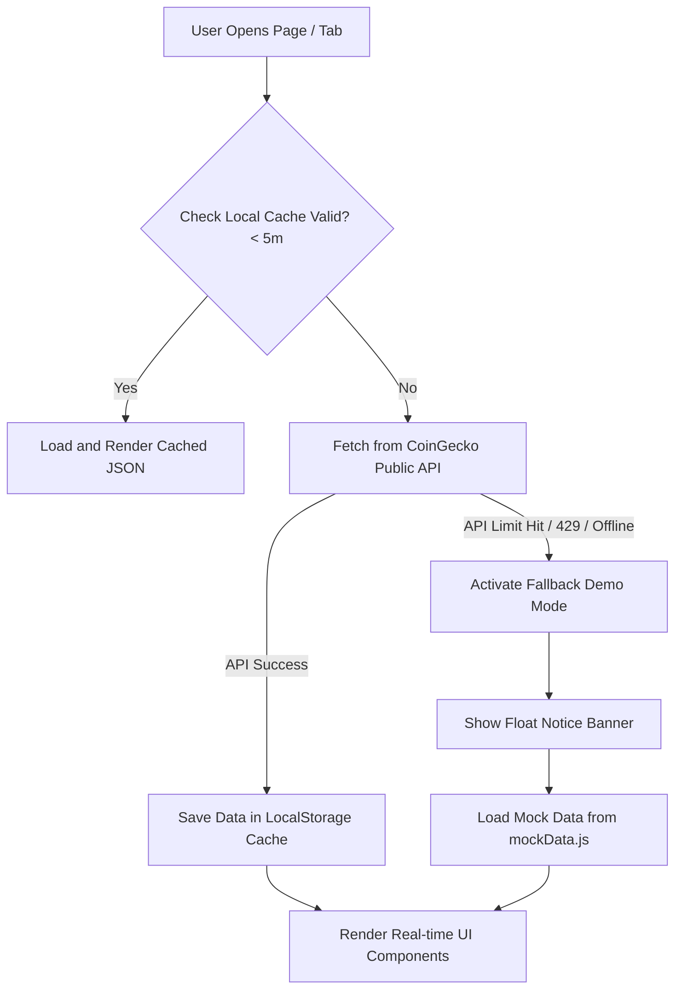

# 🚀 Kryptonix - Advanced Cryptocurrency Tracker

A premium, modern, and responsive front-end cryptocurrency marketplace tracker that displays real-time asset prices, advanced TradingView charts, NFT statistics, and public Bitcoin holdings. Built with a stunning obsidian glassmorphism theme, relative routing, local storage caching, and a robust API rate-limit fallback layer.

---

## 🔗 Live Links

- **Live Web Page Demo:** [https://codexgamerz.github.io/crypto-website/](https://codexgamerz.github.io/crypto-website/)
- **GitHub Code Repository:** [https://github.com/CODExGAMERZ/crypto-website](https://github.com/CODExGAMERZ/crypto-website)

---

## ✨ Features Checklist

- [x] **Premium Dark-First Visuals:** Implements modern glassmorphism panels, custom styled scrollbars, smooth transitions, and glowing indicator badges.
- [x] **API Fallback Demo Mode:** Integrated a comprehensive mock dataset (`mockData.js`). If the CoinGecko API returns a rate-limit error (HTTP 429), the tracker switches to demo mode and displays a warning banner instead of breaking the layout.
- [x] **Double-Level Caching:** Standardized a 5-minute local storage cache across all pages (Global data, asset lists, detail pages) to minimize external network requests and prevent rate limits.
- [x] **Flexible Relative Routing:** Removed hardcoded absolute paths, enabling the project to run natively under local files (`file://` protocol) and GitHub Pages subfolders.
- [x] **Interactive Charts:** Sparklines rendered dynamically via `Chart.js` for asset rows, alongside full-sized interactive widgets powered by `TradingView`.
- [x] **Global Statistics Ticker:** Track active coins count, exchanges list, global market cap volume, and dominance percentages.
- [x] **Multi-Tab Portal:** Toggle markets for spot assets, crypto exchanges, categories growth, and institutional holdings (treasury).
- [x] **Overlay Mobile Menu:** A fully responsive slide-out drawer optimized for phones and tablets.

---

## 🛠 Tech Stack

- **HTML5** – Structured semantic elements.
- **CSS3 (Vanilla)** – Custom design tokens, glassmorphic filters, and layouts (Flexbox & Grid).
- **JavaScript (ES6)** – Handles network integrations, local storage caching, and mock fallbacks.
- **Chart.js** – Renders 7-day sparkline charts for main listing cards.
- **TradingView API** – Integrates high-fidelity widgets for quotes and technical analysis.
- **CoinGecko API** – Serves as the primary real-time cryptocurrency data feed.

---

## 📈 System Architecture & Data Flow

Kryptonix utilizes a caching-first data flow to ensure fast response times and keep the app functional even during API outages:



---

## 📁 Project Structure

```
Kryptonix/
│── index.html              # Main markets index portal (Assets, Exchanges, categories)
│── LICENSE                 # Project license
│── README.md               # Product documentation & flowcharts
│── pages/
│   ├── about.html          # Corporate mission and story
│   ├── charts.html         # Advanced TradingView technical chart portal
│   ├── coin.html           # Detailed statistics profile & quote widget
│   └── search.html         # Search engine listings for tokens, nfts, & markets
└── assets/
    ├── css/
    │   └── style.css       # Obsidian styling rules & glassmorphic system
    ├── images/
        └── about.png       # Generated custom workspace illustration
    └── js/
        ├── mockData.js     # Standalone local fallback JSON datasets
        ├── global.js       # Global statistics bar & menu operations
        ├── script.js       # Main page tables & Chart.js sparkline logic
        ├── chart.js        # TradingView dashboard setup
        ├── coin.js         # Detail view parsing & TradingView quotes load
        └── search.js       # Search parser & redirection routing
```

---

## 🚀 How to Run Locally

### Option 1: Direct File Launch

Because Kryptonix relies entirely on relative paths, you can run it directly:

1. Clone the repository:
   ```bash
   git clone https://github.com/CODExGAMERZ/crypto-website.git
   ```
2. Navigate to the folder.
3. Double-click `index.html` to open it in any web browser.

### Option 2: Local Web Server (Recommended)

To prevent CORS policies on advanced browser scripts, host it on a local static server:

1. If you have NodeJS installed, run:
   ```bash
   npx serve .
   ```
2. If you are using VS Code, install the **Live Server** extension, right-click `index.html`, and select **Open with Live Server**.

---

## 🚀 Deployment

This project is configured for continuous deployment using **GitHub Pages** directly from the `main` branch.

To host your own copy:

1. Fork this repository.
2. Go to **Settings > Pages** on your GitHub repo.
3. Set the source build to the `/root` of the `main` branch and click **Save**.

---

## 👤 Author

- **CODExGAMERZ** – [GitHub Profile](https://github.com/CODExGAMERZ)

⭐ _If you find this project useful, consider giving it a star!_
